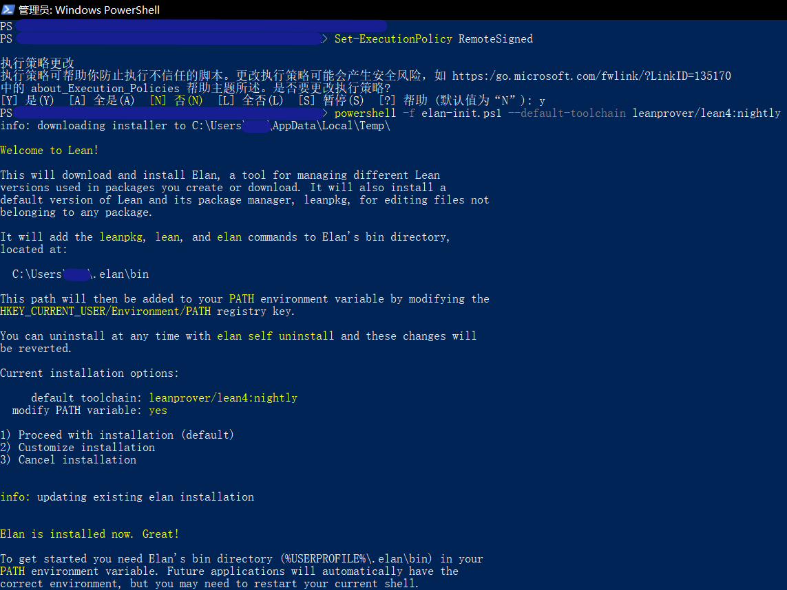
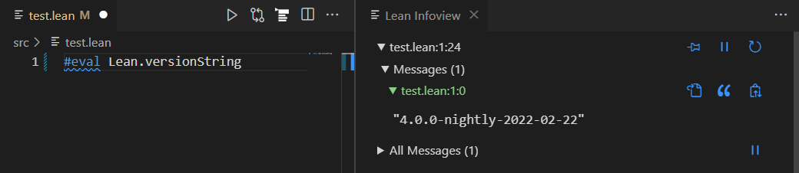

安装Lean
---------------

（updates in 2023.09.25）

本教程演示在Windows系统下如何安装Lean 4正式版。Linux和MacOS版本请参考Lean Manual。

> 如果你身在中国，在运行安装程序前需要做如下准备：
> 
> 在系统目录C:\Windows\System32\drivers\etc文件夹下找到hosts文件。对于其它系统用户也都是找到各自系统的hosts文件。
> 
> 这个文件需要管理员权限来修改，有一个简便方法是，把它复制到别的地方修改，然后再粘贴回去，并选择使用管理员身份继续。
> 
> 用记事本打开这个文件，在最后一行写入`185.199.108.133 raw.githubusercontent.com`
> 
> 重启电脑，然后开启科学上网。（注意，你需要让终端也处在梯子的作用域中，例如你使用clash类梯子需要打开**全局**模式。）
> 
> （经过这个步骤之后你也可以使用官网提供的方法来安装了。）
>
> 如果你遇到"SSL connect error", "Timeout was reached","Failed to connect to github.com port 443"...等错误，就是说明你的网络环境有问题。重启电脑或者检查你的梯子。

## 基本安装

所有受支持平台的发布版本都可以在<https://github.com/leanprover/lean4/releases>中找到。

1. 使用Lean版本管理器[elan](https://github.com/leanprover/elan)代替下载文件和手动设置路径。
   
   在elan的[Github仓库](https://github.com/leanprover/elan)中下载最新release（对于windows，请下载elan-x86_64-pc-windows-msvc.zip），解压运行elan-init.exe，按照指示安装。
   
   默认安装位置是用户文件目录下的`.elan`文件夹，添加环境变量`你的用户文件目录\.elan\bin`。

    > 可能出现以下报错*无法加载文件……因为在此系统上禁止运行此脚本*”。解决方案是
    > 
    > 1.用管理员身份运行Powershell；
    > 
    > 2.输入命令`set-Executionpolicy Remotesigned`，选择`Y`；
    > 
    > 然后就可以正常使用了。考虑到系统安全性，建议安装完成后将该选项改回默认值`N`。
    > 
    > 效果如下图
    > 
    > 
    > 
    > 由于本网站无法提供讨论区，欢迎向译者提供新的报错和解决方案，以丰富本页面。可邮件至[subfishzhou@gmail.com](mailto:subfishzhou@gmail.com)

2. 安装[git](https://gitforwindows.org/)。安装 [VS Code](https://code.visualstudio.com/)，并安装`lean4`扩展。

    

3. 在终端中运行

    ```sh
    $ elan self update  # 以防你下载的不是最新版elan
    # 下载及应用最新的Lean4版本 (https://github.com/leanprover/lean4/releases)
    $ elan default leanprover/lean4:stable
    # 也可选择，只在当前目录下使用Lean4
    $ elan override set leanprover/lean4:stable
    ```

4. 创建一个以 `.lean` 为扩展名的新文件，并写入以下代码：
    ```lean
    #eval Lean.versionString
    ```
    你会看到语法高亮。当你把光标放在最后一行时，在右边有一个“Lean信息视图”，显示已经安装的Lean版本。

    

## 创建新Lean项目

用VS code打开一个新文件夹，你可以用两种方式创建新工程。

1. 在终端中运行（`<your_project_name>`替换为你自己起的名字）

    ```
    lake init <your_project_name>
    ```
    以创建一个名为your_project_name的空白新工程。如果你想把你的Lean程序编译成可执行文件，在终端中运行`lake build`命令。
    
    如果你想在这个现有的工程中引用Mathlib4，你需要在`lakefile.lean`文件中加入
    ```
    require mathlib from git
        "https://github.com/leanprover-community/mathlib4"
    ```
    然后在终端中运行
    ```
    curl -L https://raw.githubusercontent.com/leanprover-community/mathlib4/master/lean-toolchain -o lean-toolchain
    ```

2. 如果你想直接创建一个引用Mathlib4的新工程，在终端中运行

    ```
    lake +leanprover-community/mathlib4:lean-toolchain new <your_project_name> math
    ```
    以创建一个名为your_project_name的新工程。

### 使用Mathlib

*更多内容请参考[Mathlib Wiki](https://github.com/leanprover-community/mathlib4/wiki/Using-mathlib4-as-a-dependency)*

在你的项目文件夹下打开VS code，使用终端运行

```
lake update
lake exe cache get
```

如果你看到终端中显示了类似如下的提示：

```
Decompressing 1234 file(s)
unpacked in 12345 ms
```
同时你的项目文件夹中出现了lake-packages文件夹，那么证明你安装Mathlib成功了，重启系统即可使用。**注意：你要在lake-packages所在的目录中运行VScode，才能让Lean使用Mathlib。**

这里提供一个实例来测试你的安装：
```
import Mathlib.Data.Real.Basic
example (a b : ℝ) : a * b = b * a := by
  rw [mul_comm a b]
```
如果你的Lean infoview没有任何报错，并且光标放在文件最后一行时会提示“No goals”，证明你的Mathlib已经正确安装了。

如果你想更新Mathlib，在终端中运行

```
curl -L https://raw.githubusercontent.com/leanprover-community/mathlib4/master/lean-toolchain -o lean-toolchain
lake update
lake exe cache get
```